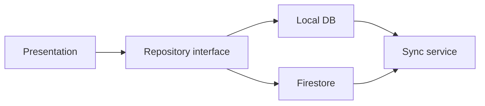

# BogenTrack Architecture

> UI conventions: see [`docs/DESIGN.md`](DESIGN.md). Theme code: `lib/core/theme/`. Shared widgets: `lib/core/widgets/`.

This document defines the target architecture for porting archery tracking features from the legacy `app/` web prototype into Flutter.

## Layering

```
presentation/   Widgets, pages, Riverpod providers scoped to UI
domain/         Models, repository interfaces, business rules
data/           Firebase / local DB implementations of repositories
```

Auth is implemented under `lib/features/auth/`. Training data features follow the same layout under `sessions/`, `equipment/`, and `notes/`.

## Domain models (defined, not yet persisted)

| Model | Location | Purpose |
|-------|----------|---------|
| `Session` | `lib/features/sessions/domain/session.dart` | One training visit |
| `TrainingSet` | `lib/features/sessions/domain/training_set.dart` | Arrow set within a session |
| `ScoreEntry` | `lib/features/sessions/domain/score_entry.dart` | Single arrow score |
| `EquipmentConfig` | `lib/features/equipment/domain/equipment_config.dart` | Bow/arrow setup |
| `Note` | `lib/features/notes/domain/note.dart` | Free-form training notes |

Repository interfaces (`SessionRepository`, `EquipmentRepository`, `NoteRepository`) define persistence contracts without binding to a storage backend.

## Recommended persistence strategy

1. **Local-first** with `drift` or `isar` for offline score entry at the range.
2. **Cloud sync** with `cloud_firestore` keyed by `userId`, mirroring the legacy `app/` data shapes.
3. **Sync layer** in `data/` that writes locally first, then pushes to Firestore when online.



## Routing

`go_router` in `lib/router/app_router.dart` guards routes by auth state. New feature routes (sessions list, session detail, equipment, stats) should be added as sibling `GoRoute` entries under `/`.

## State management

- **Riverpod** for dependency injection and auth state (`authRepositoryProvider`, `authStateChangesProvider`).
- Feature-specific `StreamProvider` / `FutureProvider` instances should live next to their presentation layer once repositories are implemented.

## Next implementation steps

1. Implement `FirestoreSessionRepository` (or local DB first) behind `SessionRepository`.
2. Add `sessions` routes: `/sessions`, `/sessions/:id`, `/sessions/new`.
3. Port score-entry UI from `app/create-set.html` into a Flutter page using `TrainingSet` + `ScoreEntry`.
4. Add `integration_test` covering sign-in → create session → save set.
5. Enable `flutter gen-l10n` before public launch.

## Legacy `app/` folder

The `app/` HTML/JS prototype remains a reference for UX and data shapes. Do not import it into Flutter; reimplement features against the domain models and repositories above.
